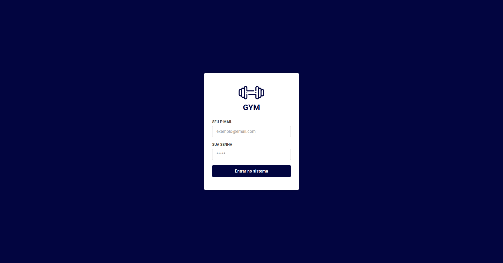
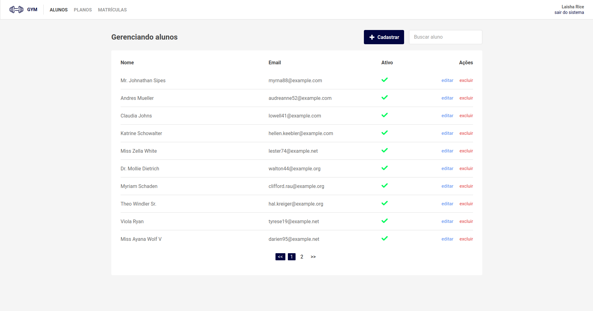

# SPA (ainda em construção)

Repositório contem exemplo de uma SPA feita em VUE.JS com vuex e vue-router,
contendo exemplos de:

- Autenticação JWT
- Rotas protegidas e publicas
- Controle de token expirado
- Modal
- Paginação
- Pesquisa

## Como executar

### Configurar o backend

O backend está no repositório:
[https://github.com/WillRy/gym-api-laravel](https://github.com/WillRy/gym-api-laravel)

### Prints

